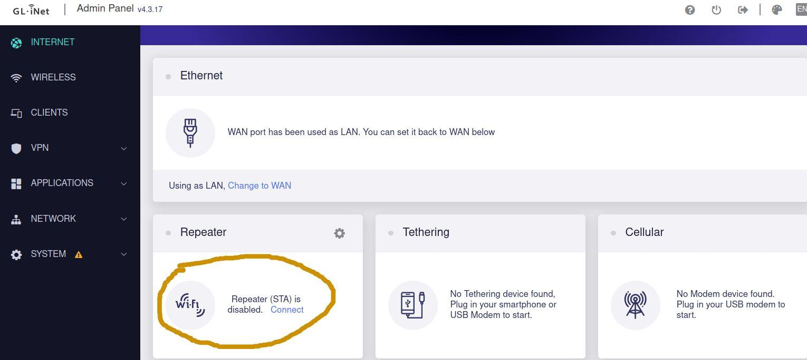
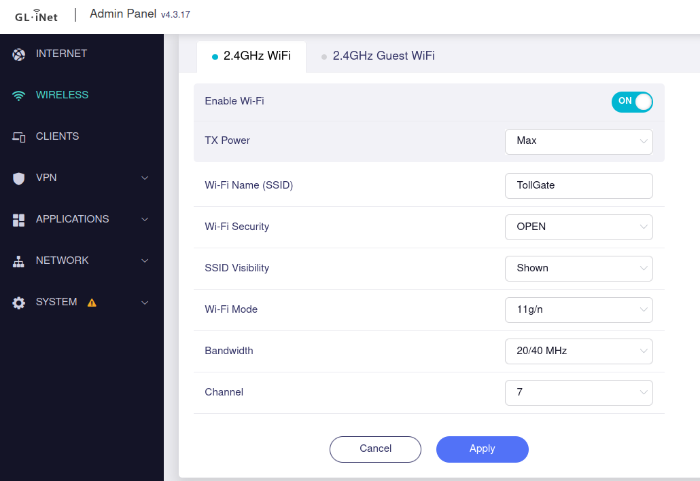

# Setup

1. **Connect to the Router:**
   - Use a LAN cable to connect your device to the router's port labeled `LAN`.

2. **Access the Router Interface:**
   - Load `192.168.8.1` in your browser to access the router's web interface.

3. **Connect the Router to an Internet Gateway via Wi-Fi:**
   - In the router's settings, connect it to an available Wi-Fi network that serves as the internet gateway.
   - Set the following:
     - **SSID:** TollGate
     - **WiFi Security:** Open

   
   

4. **Access the Router via SSH:**
   - Use the command `ssh root@192.168.8.1` to access the router's terminal. You will need the password that you set up in the GUI.

5. **Run the Setup Script:**
   - Execute the following command on the router:
     ```
     cd /tmp/ && curl -s https://raw.githubusercontent.com/chGoodchild/GLTollGate/main/setup_online.sh | sh
     ```

6. **Testing and Bypassing Payment (for testing purposes only):**
   - To bypass the payment requirement for testing, you can log in via SSH and stop the captive portal service:
     ```
     service nodogsplash stop
     ```

[Useful Commands for GLTollGate Setup](https://github.com/chGoodchild/GLTollGate/blob/main/useful_commands.md)


# Acknowledgements

Special thanks to the `nym` who came up with this idea, to
`npub1elta7cneng3w8p9y4dw633qzdjr4kyvaparuyuttyrx6e8xp7xnq32cume` for
helping me and everyone who controls
`npub1u3w2g4s9gpefczy3gf8tah4ghum5tav56hcn62jpft6jw76ax3fqj9wxcv` for
encouraging me to work on the right things.

